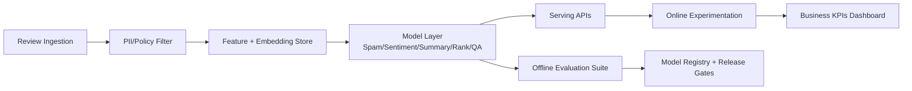

Commerce reviews are one of the highest-leverage data assets in digital retail. They influence conversion, return rate, customer support load, and trust. This guide organizes **review-driven AI/ML use cases**, the **online and offline metrics** used by production teams, and the **major methodologies** you can use to implement each one.

---

## 1) High-Impact AI/ML Use Cases From Reviews

1. **Review quality filtering & spam/fraud detection**
   - Detect fake, incentivized, duplicated, or low-information reviews.
2. **Sentiment and aspect mining**
   - Extract sentiment for aspects like size, durability, delivery, and value-for-money.
3. **Review summarization**
   - Generate concise product-level and aspect-level summaries.
4. **Review-aware ranking and recommendation**
   - Use review semantics as features for search ranking and recommendation models.
5. **Question answering from reviews**
   - Answer pre-purchase questions (“Is this good for wide feet?”) with grounded review evidence.
6. **Personalized review highlighting**
   - Rank review snippets based on user profile, intent, and context.
7. **Early defect/trend detection**
   - Detect quality issues, safety signals, and emerging trends from review streams.
8. **Moderation and policy compliance**
   - Detect toxic, abusive, personally identifiable, or policy-violating content.
9. **Review-to-ops intelligence**
   - Convert review signals into actions for catalog, logistics, and vendor management.

---

## 2) Online Metrics (Production KPI Layer)

Online metrics are measured in A/B tests or online learning loops and reflect business impact.

| Metric | Formula | Why it matters | Typical use cases |
|---|---|---|---|
| Conversion Rate (CVR) | `CVR = Orders / Sessions` | Primary revenue signal | Ranking, summaries, QA |
| Revenue per Session (RPS) | `RPS = Revenue / Sessions` | Monetization quality | Ranking, recommendation |
| Add-to-Cart Rate | `ATC = AddToCart / Sessions` | Mid-funnel intent | Search/snippet relevance |
| Click-Through Rate (CTR) | `CTR = Clicks / Impressions` | Attention capture | Review highlight ranking |
| Purchase Rate after Review Interaction | `PRR = Purchases_after_review / Review_interactions` | Review UI effectiveness | Summaries, snippets, QA |
| Bounce Rate | `Bounce = SinglePageSessions / Sessions` | Friction/irrelevance proxy | Search + review UX |
| Return Rate | `Returns / Orders` | Long-term fit quality | Sentiment/aspect accuracy |
| Ticket Deflection Rate | `1 - (Tickets_with_feature / Tickets_baseline)` | CS efficiency | Review QA/chatbot |
| Abuse Escalation Rate | `Escalated_content / Moderated_content` | Moderation quality | Policy models |
| Latency p95 | `p95(response_time_ms)` | UX + infrastructure health | LLM summarization/QA |

### Guardrail Metrics (Always Track)
- **Gross margin impact** (to prevent revenue-only optimization).
- **Complaint rate / refund rate** (to detect misleading model behavior).
- **Fairness parity across brands/sellers**.
- **Freshness lag** (time for new reviews to affect model outputs).
- **Fallback rate** (percentage routed to heuristic or static baseline).

---

## 3) Offline Metrics (Model Quality Layer)

Offline metrics are pre-launch indicators and continuous diagnostics.

### A. Classification Tasks (spam, sentiment, moderation)
- **Precision**: `Precision = TP / (TP + FP)`
- **Recall**: `Recall = TP / (TP + FN)`
- **F1**: `F1 = 2 * (Precision * Recall) / (Precision + Recall)`
- **ROC-AUC / PR-AUC** for threshold-free comparison.
- **Expected Calibration Error (ECE)** for probability calibration.

### B. Ranking Tasks (snippet ranking, review-aware search)
- **NDCG@K**: graded relevance and position sensitivity.
- **MRR**: speed to first relevant item.
- **MAP@K**: average precision over relevant documents.
- **Coverage / diversity** for robust exposure.

### C. Generation Tasks (summarization, QA)
- **ROUGE / BERTScore / BLEURT** for lexical-semantic overlap.
- **Faithfulness / factual grounding rate** (human or model-judge + retrieval checks).
- **Citation correctness** (answer spans supported by source reviews).
- **Toxicity / policy violation rate**.

### D. Time-Series / Detection Tasks (defect trend detection)
- **Detection lead time**: how early issue is detected vs manual process.
- **False alarm rate** and **miss rate**.
- **Mean Time To Detect (MTTD)** and **Mean Time To Acknowledge (MTTA)**.

### E. Business-Proxy Offline Metrics
- **Purchase intent uplift prediction** (counterfactual modeling).
- **Review helpfulness prediction quality**.
- **Price sensitivity segment separability** from review language.

---

## 4) Methodology Playbook by Use Case

Below are the major implementation methods in practice. In most production systems, teams combine multiple methods.

## 4.1 Spam/Fraud Review Detection

### Methods
1. **Rule-based heuristics** (velocity spikes, duplicate text, suspicious IP/device patterns).
2. **Supervised classifiers** (XGBoost, LightGBM, BERT fine-tuning).
3. **Graph-based detection** (reviewer-product-seller bipartite graph anomalies).
4. **Sequence anomaly models** (temporal bursts, hidden collusion waves).
5. **LLM-assisted forensic labeling** for weak supervision and triage.

### Pros / Cons
- **Rules**: fast, interpretable; weak generalization.
- **Supervised models**: high precision/recall with labels; labeling is expensive and adversaries adapt.
- **Graph models**: capture collusion better; harder to operate and explain.
- **LLM triage**: flexible and fast to iterate; cost/latency and consistency risks.

---

## 4.2 Sentiment + Aspect Mining

### Methods
1. **Lexicon/rule systems** (seed dictionaries).
2. **Classical NLP + linear models** (TF-IDF + Logistic Regression/SVM).
3. **Transformer classification** (BERT/RoBERTa/DeBERTa).
4. **Token-level sequence labeling** (BiLSTM-CRF / transformer NER) for aspect extraction.
5. **Prompted LLM structured extraction** (JSON schema constrained decoding).

### Pros / Cons
- **Lexicon**: interpretable and cheap; poor nuance and multilingual robustness.
- **Classical ML**: strong baseline and low infra; limited compositional understanding.
- **Transformers**: strong accuracy; needs GPU training/inference optimization.
- **Prompted LLM extraction**: rapid launch; schema drift and extraction variance without guardrails.

---

## 4.3 Review Summarization

### Methods
1. **Extractive summarization** (TextRank, MMR, centroid methods).
2. **Abstractive seq2seq** (T5/BART/PEGASUS).
3. **RAG-based summarization** (retrieve top evidence then generate).
4. **Hierarchical summarization** (review -> aspect -> product).
5. **Constrained generation** (must cite snippets, templates, safety filters).

### Pros / Cons
- **Extractive**: faithful and cheap; less fluent and repetitive.
- **Abstractive**: concise and readable; hallucination risk.
- **RAG + constraints**: better grounding; higher system complexity and latency.

---

## 4.4 Review-Aware Search Ranking / Recommendation

### Methods
1. **Feature engineering + GBDT** (review rating stats, recency, sentiment).
2. **Learning-to-rank** (LambdaMART, pairwise/listwise objectives).
3. **Dual encoders / bi-encoders** for query-review semantic matching.
4. **Cross-encoders** for high-precision reranking.
5. **Multitask models** optimizing click + conversion + return minimization.
6. **Bandits / RL** for adaptive exposure.

### Pros / Cons
- **GBDT/LTR**: proven and interpretable; feature maintenance overhead.
- **Neural semantic ranking**: better intent matching; heavier serving cost.
- **Bandits/RL**: adapts quickly; exploration risk and experiment governance burden.

---

## 4.5 Review Grounded QA

### Methods
1. **FAQ retrieval only** (BM25/vector search).
2. **RAG QA with citations**.
3. **Agentic QA pipeline** (retrieve -> verify -> answer -> safety check).
4. **Hybrid deterministic + generative templates**.

### Pros / Cons
- **Retrieval only**: highly safe; low coverage for long-tail questions.
- **RAG QA**: good coverage and UX; hallucination if retrieval fails.
- **Agentic QA**: better reliability controls; expensive and operationally complex.

---

## 4.6 Early Defect and Trend Detection

### Methods
1. **Topic modeling** (LDA, BERTopic).
2. **Embedding clustering + drift detection**.
3. **Change-point detection** (CUSUM, Bayesian online change detection).
4. **Forecasting residual alerts** (Prophet/ARIMA + anomaly threshold).

### Pros / Cons
- **Topic models**: interpretable themes; may miss subtle failures.
- **Embedding + drift**: captures semantic shift; threshold tuning is non-trivial.
- **Change-point methods**: strong temporal detection; sensitive to seasonality and promotions.

---

## 5) End-to-End Measurement Architecture



### Release Gate Example
Ship only if all conditions pass:

`Delta NDCG@10 >= 1.5% AND Delta CVR >= 0.5% AND Delta ReturnRate <= 0.0% AND p95 latency <= 250ms`

---

## 6) Practical Experiment Design

1. **Define a primary metric + 2–4 guardrails**.
2. **Use CUPED / variance reduction** where possible.
3. **Segment by cold-start vs warm products**, high vs low review volume, and price tier.
4. **Run at least one holdout for long-term effects** (returns, complaint rates).
5. **Track novelty decay** for generated summaries and snippets.

### Minimal Python Example: Offline Classification Report

```python
from sklearn.metrics import classification_report, roc_auc_score

y_true = [1, 0, 1, 1, 0, 0, 1]
y_pred = [1, 0, 1, 0, 0, 0, 1]
y_prob = [0.95, 0.20, 0.88, 0.42, 0.11, 0.33, 0.77]

print(classification_report(y_true, y_pred, digits=4))
print('ROC-AUC:', roc_auc_score(y_true, y_prob))
```

### Minimal SQL Example: Online Conversion by Variant

```sql
SELECT
  experiment_variant,
  COUNT(DISTINCT session_id) AS sessions,
  COUNT(DISTINCT CASE WHEN ordered = 1 THEN session_id END) AS order_sessions,
  COUNT(DISTINCT CASE WHEN ordered = 1 THEN session_id END) * 1.0
    / NULLIF(COUNT(DISTINCT session_id), 0) AS cvr
FROM events
WHERE event_date BETWEEN DATE '2026-02-01' AND DATE '2026-02-21'
GROUP BY 1;
```

---

## 7) Common Failure Modes and Mitigations

1. **Reward hacking**: CTR up but return rate worsens.  
   - Mitigation: multi-objective optimization and strict guardrails.
2. **Selection bias**: only vocal users leave reviews.  
   - Mitigation: reweighting, inverse propensity scoring, and calibration.
3. **Cold start**: new SKUs have sparse review data.  
   - Mitigation: transfer learning from taxonomy-level features.
4. **Language/domain drift**: new slang, seasonal terms.  
   - Mitigation: continuous evaluation + scheduled refresh.
5. **Generative hallucination** in summaries/QA.  
   - Mitigation: citation-required generation + retrieval confidence thresholds.

---

## 8) Recommended Implementation Roadmap

### Phase 1 (4–6 weeks): Fast ROI
- Spam filtering baseline + sentiment classifier + review snippet ranking.
- Offline benchmark suite with precision/recall, NDCG@K, and faithfulness checks.

### Phase 2 (6–10 weeks): Product Expansion
- Review summarization + RAG QA with citations.
- Controlled rollout by category and traffic tier.

### Phase 3 (Ongoing): Optimization & Governance
- Multi-objective rankers (CVR, margin, returns).
- Drift detection, fairness reviews, and retraining automation.

---

## 9) Quick Reference: Method Selection Matrix

| Problem Context | Best First Method | Upgrade Path |
|---|---|---|
| Low data, high urgency | Rules + classical ML | Weak supervision + transformer fine-tuning |
| High scale, mature labels | Learning-to-rank + transformers | Multitask + causal optimization |
| High trust requirement | Extractive + retrieval QA | Constrained RAG + verifier models |
| Rapidly changing domain | Prompted LLM + human review | Distilled task models + active learning |

---

If you want, I can provide a **team-ready KPI sheet template** (Google Sheets/Notion format) and a **model card checklist** tailored to your commerce stack.
