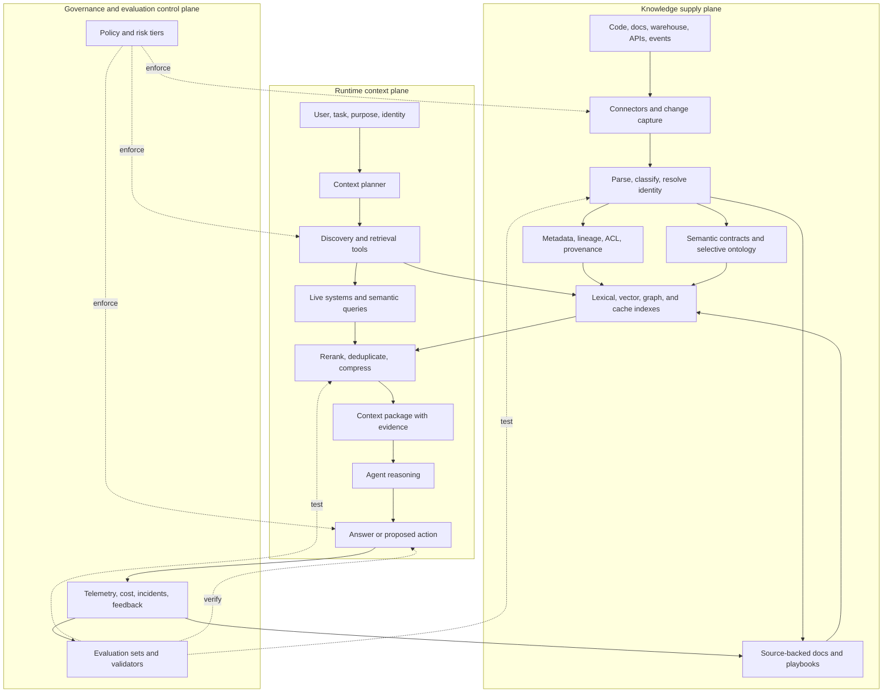

Many companies are now running several versions of the same initiative. One team generates a wiki from code. Another catalogs warehouse tables. A third defines business metrics. A fourth builds a knowledge graph. Each team expects an agent to become more useful once enough context has accumulated.

The intuition is sound, but accumulation alone is not the system.

**An enterprise needs three separable planes: a knowledge supply plane that turns sources into governed knowledge products, a runtime context plane that selects the smallest useful evidence for each task, and a control plane that enforces identity, policy, quality, and evaluation across both.**

This framing resolves a common organizational confusion. The company does not need to “collect all context.” It needs to make specific high-value tasks measurably better. Code documentation, a semantic metric layer, an ontology, a vector index, and an MCP tool are possible components. None is the objective.

## Your two axes are right, but they need a control plane

The first two axes are easy to recognize:

1. **Accumulate knowledge:** capture code, documents, tables, schemas, metrics, lineage, policies, incidents, and domain relationships.
2. **Use knowledge as context:** let an agent discover, retrieve, query, and apply the right material during a task.

The missing third axis decides whether either one can be trusted:

3. **Control and improve the loop:** preserve source permissions, ownership, provenance, freshness, evaluation cases, write policy, and action authority.

Without the first plane, the model knows little about the company. Without the second, a large corpus becomes an expensive archive. Without the third, the agent can retrieve stale or unauthorized material, write low-quality memory back into the system, or act on a plausible but incorrect interpretation.

This is why the architecture is closer to a supply chain than a wiki:

```text
authoritative sources
  → normalized knowledge products
  → task-aware retrieval and tools
  → bounded agent decision or action
  → evidence, outcome, and feedback
  → source and knowledge maintenance
```

[Anthropic's context-engineering guidance](https://www.anthropic.com/engineering/effective-context-engineering-for-ai-agents) defines the runtime problem as curating the information placed into a model's context. Its practical recommendation is not maximal context but the smallest high-signal set that improves the desired behavior. That is consistent with the [Lost in the Middle](https://arxiv.org/abs/2307.03172) finding that long-context models can use information unevenly depending on where it appears. A larger window is useful capacity, not a reason to load the company into every prompt.

## Start from knowledge demand, not content supply

Teams often collect knowledge for understandable but weak reasons:

- another domain has a wiki or graph;
- an AI platform program needs visible artifacts;
- generating summaries is now cheap;
- people assume more indexed content must improve answer quality;
- no one wants to be the team that appears unprepared for agents.

This produces a supply-led program: connect everything, generate pages, count documents, and hope use cases arrive later. The maintenance burden appears immediately, while the value remains hypothetical.

Reverse the sequence. Begin with 20 to 50 real tasks that are slow, repetitive, error-prone, or bottlenecked on experts. For each task, record:

- the user and business decision;
- the authoritative evidence a competent employee uses;
- the systems and permissions required;
- the expected answer or action;
- the cost of a wrong result;
- the freshness requirement;
- a verification method.

Examples include “Which service owns this failing API?”, “Why did weekly active buyers decline?”, “Can this order be refunded?”, and “Which policy applies to this customer and region?” These questions reveal different knowledge needs. The first may need code search, ownership metadata, deployment history, and an incident playbook. The second needs governed metric definitions, dimensions, lineage, and query execution. The third needs live transaction state and deterministic policy, not a wiki summary.

A knowledge artifact deserves ongoing maintenance when it passes most of these tests:

| Test | Question |
| --- | --- |
| Reuse | Will multiple people or agents need it repeatedly? |
| Authority | Can its source of truth and owner be named? |
| Decision impact | Does it change an answer, decision, or action? |
| Freshness | Can staleness be detected or bounded? |
| Evaluability | Can a test show whether using it improves the task? |
| Maintenance economics | Is reuse worth ingestion, review, and repair cost? |

If a team cannot name the target tasks or evaluation cases, it is probably building an archive, not an agent capability.

## Build a layered knowledge supply plane

“Enterprise knowledge” hides several artifact types with different truth and update models. Keep them distinct even if one catalog exposes all of them.

### Layer 0: authoritative sources

These are the systems that can settle a dispute:

- source code, API specifications, tests, and deployment configuration;
- warehouse tables, operational databases, and event streams;
- approved policies, contracts, tickets, dashboards, and incident records;
- live services for inventory, orders, identity, pricing, and permissions.

Do not replace these sources with generated prose. A code wiki may explain a service, but the repository remains authoritative. An agent may summarize a refund policy, but the policy engine and approved document remain authoritative.

### Layer 1: discoverability and governance metadata

This layer answers: What exists? Who owns it? Who may see it? How fresh is it? What depends on it?

Useful fields include stable ID, type, domain, owner, source URI, schema version, classification, access policy, created time, valid time, freshness SLA, lineage, and deprecation state. [OpenLineage](https://github.com/OpenLineage/OpenLineage/blob/main/spec/OpenLineage.md) provides common primitives for datasets, jobs, runs, and extensible facets. [W3C PROV-O](https://www.w3.org/TR/prov-o/) provides interoperable concepts for entities, activities, agents, and derivation.

Platforms such as [DataHub](https://docs.datahub.com/) and [OpenMetadata](https://docs.open-metadata.org/v1.12.x/api-reference/data-contracts) combine catalog, ownership, lineage, quality, glossary, and contract responsibilities. The exact product matters less than preserving these interfaces.

### Layer 2: semantic contracts

This layer tells humans and agents what a thing means and how it may be used:

- canonical entities and identifiers;
- metric definitions, dimensions, filters, and time grain;
- table and field descriptions with representative values;
- business terms, synonyms, exclusions, and domain boundaries;
- quality expectations, terms of use, and known limitations.

For analytics, an executable metric definition is more valuable than a paragraph that says what revenue “usually means.” [MetricFlow](https://github.com/dbt-labs/metricflow) is one example: metrics are defined in code and compiled into SQL. The agent can discover the metric, but the semantic layer executes the approved definition.

### Layer 3: derived knowledge

This is where LLM Wiki-style artifacts belong:

- repository architecture pages;
- source-backed concept and entity pages;
- runbooks and troubleshooting records;
- examples of approved queries;
- decision records and executable playbooks;
- compact memory blocks derived from repeated behavior or explicit statements.

Derived knowledge saves repeated synthesis, but it must retain citations, version, owner, applicable conditions, and invalidation signals. The [LLM Wiki guide](/blog/llm-wiki-engineering-guide/) describes the required source, wiki, and mutation boundaries in detail.

### Layer 4: indexes and caches

Lexical indexes, embeddings, graph projections, summaries, and caches are derived serving state. They should be reproducible from the layers above. Treating an embedding index as the knowledge base makes access deletion, model migration, provenance, and incident repair unnecessarily difficult.

## Do not ontology everything

An ontology is useful when shared entities and relationships repeatedly change how systems interpret or act on information. It is not the entry fee for enterprise agents.

Use the smallest semantic mechanism that solves the evaluated task:

| Need | Start with |
| --- | --- |
| Find pages, code, tickets, or policies | Metadata plus lexical or hybrid search |
| Produce consistent business numbers | Executable metric and dimension definitions |
| Resolve names across systems | Canonical IDs, mappings, and entity resolution |
| Answer relationship or corpus-wide questions | A graph projection or selective knowledge graph |
| Govern state-changing business actions | Operational domain model, policy, and typed action contracts |

GraphRAG is useful for questions that require corpus-wide synthesis or relationships that a local top-k search cannot expose. Microsoft's [GraphRAG global search](https://microsoft.github.io/graphrag/query/global_search/) uses entity communities and precomputed reports for this class of question. But graph retrieval is not solved merely by creating nodes and edges. A [NeurIPS 2025 paper on KG-based RAG](https://proceedings.neurips.cc/paper_files/paper/2025/hash/89d0d5c2f720921df93bbb8fef514571-Abstract-Conference.html) begins from the continuing difficulty of retrieving accurate and diverse information from text-rich knowledge graphs.

The practical rule is to let failed evaluations earn each new semantic layer. Add entity resolution when aliases cause misses. Add a metric layer when generated SQL disagrees about definitions. Add a graph when multi-hop or global questions fail. Add an operational ontology when several agents need the same business objects, relationships, policies, and actions. The [ontology operating-layer guide](/blog/ontology-operating-layer-for-ai-agents/) covers that last boundary.

## Compile context at runtime

The runtime plane should behave like a compiler. It takes a user, purpose, task, budget, and available knowledge products, then produces a bounded context package.

```text
request + identity + purpose
          ↓
task and risk classification
          ↓
source and tool discovery
          ↓
permission-aware retrieval and structured queries
          ↓
fusion, reranking, deduplication, freshness checks
          ↓
context compilation with citations and token budget
          ↓
model reasoning
          ↓
answer validation or action policy
```

The compiled package should carry evidence, not just text:

```json
{
  "task": "explain_metric_change",
  "principal": "employee:1234",
  "purpose": "weekly_business_review",
  "as_of": "2026-08-06T00:00:00Z",
  "evidence": [
    {
      "source_id": "metric:active_buyers",
      "version": "git-sha-or-catalog-version",
      "owner": "growth-analytics",
      "valid_at": "2026-08-05T23:00:00Z",
      "citation": "catalog://metrics/active_buyers"
    }
  ],
  "limits": {
    "max_context_tokens": 24000,
    "allowed_tools": ["metric_query", "lineage_read"]
  }
}
```

This is an original reference shape, not an industry standard. Its purpose is to make hidden assumptions inspectable.

### Use several retrieval modes

One retriever cannot serve every enterprise question:

- lexical search finds exact service names, codes, SKUs, policy clauses, and rare terms;
- dense retrieval handles paraphrases and conceptual similarity;
- structured lookup retrieves known entities, schemas, owners, and live records;
- SQL or semantic queries compute governed metrics;
- graph traversal handles explicit relations and multi-hop dependencies;
- recent-session state resolves the user's current goal;
- durable memory contributes only approved, relevant facts.

Fuse and rerank candidates under hard access and freshness filters. Then compress them into a context package that preserves citations and exclusions. Retrieval quality and answer quality should be evaluated separately; Microsoft's current [RAG evaluator documentation](https://learn.microsoft.com/en-us/azure/foundry/concepts/evaluation-evaluators/rag-evaluators) similarly separates document retrieval from groundedness, relevance, and response completeness.

### Scan before read

Agents do not need full payloads to decide what to inspect. A cheap catalog or directory operation can return names, owners, timestamps, counts, schemas, and available partitions before the agent requests detailed content.

DoorDash describes this pattern in its [agent memory architecture](https://careersatdoordash.com/blog/building-ask-doordash-part-two-intelligence/): the system plans retrieval by task, mixes semantic search, deterministic keywords, and direct structured fetches, and exposes a lightweight scan before expensive reads. Raw chat logs are not treated as durable memory; stable facts are extracted, classified, deduplicated, and versioned.

## Tools turn knowledge into executable capability

Connecting tools can improve an agent, but the number of connected tools is a poor success metric. A tool is valuable when it exposes an authoritative capability with a clear input, output, permission, cost, freshness, and side-effect contract.

Separate three tool classes:

| Tool class | Examples | Default authority |
| --- | --- | --- |
| Discover | List domains, tables, services, playbooks, or data products | Broad metadata, filtered by identity |
| Read or compute | Search code, query a metric, inspect lineage, fetch live state | Purpose-bound read |
| Act | Change an order, deploy code, update a ticket, write durable memory | Narrow scope, validation, and often approval |

MCP can standardize how agents discover and invoke these capabilities. It does not decide whether the underlying data is true or the caller is entitled to an action. Current [MCP security guidance](https://modelcontextprotocol.io/docs/2026-07-28/tutorials/security/security_best_practices) covers token audience separation, scope minimization, confused-deputy risks, sandboxing, and logging. Business authorization still belongs in the downstream service and policy layer.

The higher-value unit is often an executable playbook rather than a raw API. LinkedIn's [Contextual Agent Playbooks & Tools](https://www.linkedin.com/blog/engineering/ai/contextual-agent-playbooks-and-tools-how-linkedin-gave-ai-coding-agents-organizational-context) combines internal tools with reusable workflows for tasks such as experiment cleanup, incident investigation, and data analysis. LinkedIn also moved from exposing large static tool lists toward progressive discovery, reducing context bloat while allowing the platform to grow.

This explains why a company-wide context effort is partly knowledge management and partly agent platform engineering. Documentation explains the domain. Tools obtain live evidence. Playbooks encode a proven sequence. Policies limit authority. Evaluations determine whether the combination works.

## Make governance part of the data path

Governance is not a committee that reviews the chatbot after launch. NIST's [AI RMF Core](https://airc.nist.gov/airmf-resources/airmf/5-sec-core/) treats Govern as cross-cutting across Map, Measure, and Manage. The same principle belongs in the context architecture.

### Enforce permissions before retrieval

The agent must not retrieve a confidential document and then rely on the prompt to hide it. Preserve source ACLs and classifications through ingestion, indexing, cache, retrieval, logging, and deletion. Both [Azure AI Search](https://learn.microsoft.com/en-us/azure/search/search-document-level-access-overview) and [Gemini Enterprise](https://docs.cloud.google.com/gemini/enterprise/docs/identity) document query-time approaches that filter results using source permissions.

Design for permission-change lag. If an index receives ACL updates asynchronously, measure the delay and define a fail-closed policy for sensitive sources.

### Treat retrieved content as untrusted

A wiki page, code comment, ticket, uploaded PDF, or web result can contain instructions addressed to the model. [OWASP LLM01:2025](https://genai.owasp.org/llmrisk/llm01-prompt-injection/) explicitly notes that RAG does not fully mitigate prompt injection.

Keep content and instructions in separate channels. Strip or label active content. Restrict available tools per task. Validate arguments outside the model. Never put credentials in model context. Test indirect-injection fixtures as part of every high-risk retrieval evaluation.

### Control writes separately from reads

An agent that reads knowledge and an agent that changes durable knowledge have different risk. New wiki claims, glossary definitions, entity merges, durable user memories, metric changes, and policy updates need typed mutation operations, provenance, deduplication, review thresholds, and reversible versions.

Do not let a successful answer silently become enterprise truth. Feed it into a candidate queue. Promote it only when reuse value, evidence, ownership, and validation are present.

### Separate answers from actions

Knowledge can justify a recommendation; it does not grant authority. State-changing tools need current resource state, downstream authorization, policy checks, idempotency, preview, approval rules, and postcondition verification. The [agent governance control-plane guide](/blog/agent-governance-control-plane/) provides a fuller design for that boundary.

## A reference architecture with component options



Choose components by responsibility and existing operational competence:

| Responsibility | Lean starting option | Scaled or specialized options |
| --- | --- | --- |
| Durable documents and source-backed synthesis | Git, object storage, existing wiki | Document platform with version and event APIs |
| Metadata, ownership, lineage, glossary | Small catalog tables plus OpenLineage events | DataHub, OpenMetadata, or an existing enterprise catalog |
| Metrics and analytical semantics | Versioned SQL and tests | dbt MetricFlow, Cube, LookML, or an existing governed semantic layer |
| Lexical and vector retrieval | PostgreSQL full text plus `pgvector` | OpenSearch, Elasticsearch, Vespa, Azure AI Search, or a dedicated vector service |
| Relationship traversal | Relational tables or graph projection | Neo4j, Neptune, RDF store, or a domain graph service |
| Tool contracts | Existing OpenAPI or RPC adapters | MCP façades and a governed connector registry |
| Policy enforcement | Application checks and database permissions | OPA, Cedar, cloud IAM and policy services, or an internal authorization platform |
| Orchestration | Explicit application state machine | Agent SDK or durable workflow engine when task length and recovery require it |
| Evaluation and traces | Versioned fixtures plus OpenTelemetry-compatible events | Dedicated evaluation and observability platform |

Do not buy every row. A company with ten repeated questions and one domain can start with Git, PostgreSQL, a search index, explicit tool APIs, and a regression set. A regulated multi-domain company may need a catalog, lineage event bus, source ACL synchronization, policy decision point, isolated indexes, immutable audit evidence, and formal knowledge-owner workflows.

The durable design is the contract between components: stable source IDs, principal and purpose, policy decision, evidence references, version, freshness, task outcome, and evaluation result. Products can change behind those fields.

## Measure context utility, not document volume

Document count, graph node count, embedding count, and connected-tool count measure inventory. They do not show whether an agent became useful.

Measure the full chain:

| Layer | Metric | Diagnostic question |
| --- | --- | --- |
| Supply | Authoritative-source coverage | Do evaluated tasks have the evidence they need? |
| Supply | Freshness SLA pass rate | Is context updated before its validity window expires? |
| Supply | Unsupported or ownerless claim rate | Can someone defend and maintain the knowledge? |
| Retrieval | Recall@k or task evidence recall | Did the correct evidence enter the candidate set? |
| Retrieval | ACL leakage rate | Did any unauthorized item cross the retrieval boundary? Target: zero. |
| Context | Evidence utilization and token efficiency | Did the answer use high-signal evidence without unnecessary context? |
| Answer | Grounded task success | Was the answer correct, complete, and source-supported? |
| Action | Safe completion and verification rate | Did the action satisfy policy and its postconditions? |
| Business | Time or cost per accepted outcome | Did the workflow become materially better? |
| Learning | Failure-to-fix time | How quickly does a real failure become a regression test or knowledge repair? |

Run ablations. Compare the same tasks with no company context, raw retrieval, semantic contracts, derived knowledge, and task-specific tools. If a graph adds cost without improving the graph-sensitive cases, remove it. If generated repository documentation is not retrieved or trusted, stop generating more and repair its ownership and freshness loop.

This is also the answer to “Is this really necessary?” The platform is necessary only to the extent that it produces a repeatable improvement that simpler source access does not.

## What the industry cases actually show

LinkedIn and DoorDash are useful because their examples separate storage from use.

LinkedIn reports that CAPT serves more than 1,000 engineers by combining organizational knowledge, internal tools, and executable playbooks. It instruments each invocation and uses adoption and failure data to prioritize work. LinkedIn reports roughly three times faster time from question to usable data insight in many cases and around a 70% reduction in initial customer-issue triage time. These are company-reported, workload-specific outcomes, not independent benchmarks. The transferable lesson is that the measured unit is a workflow, not a document corpus.

DoorDash's [internal agent platform](https://careersatdoordash.com/blog/beyond-single-agents-doordash-building-collaborative-ai-ecosystem/) retrieves across wikis, experiments, dashboards, and data systems with BM25, dense search, reciprocal rank fusion, schema-aware SQL context, `EXPLAIN` checks, statistical validation, and regression evaluation. Again, the architecture does more than return similar chunks.

For consumer memory, DoorDash separates long-term memory generation, managed storage, and task-aware tooling. It reports that memory-backed sessions produced approximately 24% higher relative grocery basket conversion, 15% higher relative restaurant-assistant conversion, and 33% fewer intent misunderstandings. Those figures are DoorDash's own measurements. The architectural lesson is narrower and stronger: durable memory creates value only after task-aware selection, ranking, policy, and feedback connect it to a live experience.

## Divide ownership without recreating silos

A central AI team cannot author every domain definition, and domain teams should not each build an identity layer, vector platform, policy engine, and evaluation stack.

| Owner | Owns |
| --- | --- |
| AI or context platform | Ingestion framework, discovery, retrieval, context compiler, connector registry, common telemetry, evaluation runner, and paved-road SDKs |
| Data platform | Catalog, lineage, quality signals, semantic query interfaces, and analytical cost controls |
| Domain teams | Authoritative sources, terms, entity mappings, playbooks, task evaluations, freshness rules, and business outcomes |
| Security, privacy, and risk | Data classes, policy requirements, risk tiers, retention, incident controls, and exception process |
| System owners | Tool contracts, downstream authorization, side-effect safety, SLAs, and postcondition checks |
| Agent product teams | User experience, task routing, model behavior, context budget, outcome metrics, and on-call response |

Use federated ownership with a central contract. Domains publish knowledge products through shared metadata and quality rules. The platform provides a common path to agents. Governance specifies controls proportionate to risk. No team gets to declare generated knowledge authoritative merely by indexing it.

## A practical 90-day rollout

### Days 0–30: prove demand and establish the read boundary

Choose one domain and two read-only workflows. Collect real questions, expected evidence, source permissions, and baseline time-to-answer. Connect only the authoritative sources required for those cases. Define stable IDs, owner, source, freshness, ACL, and citations. Build an evaluation set before building an ontology.

**Exit gate:** The pilot can retrieve the required evidence without access leakage, and baseline versus context-assisted task success is measurable.

### Days 31–60: add semantics where failures justify them

Inspect misses. Add synonyms and entity mappings for name-resolution failures. Add metric contracts for analytical disagreement. Add source-backed repository pages when agents repeatedly reconstruct the same architecture. Introduce hybrid retrieval, reranking, and scan-before-read. Keep every derived artifact linked to an authoritative source and invalidation signal.

**Exit gate:** Retrieval recall, grounded task success, and time per accepted outcome improve enough to justify maintenance. Remove components that do not contribute.

### Days 61–90: package workflows and close the control loop

Turn stable expert procedures into playbooks. Expose narrow read or compute tools first. Add risk classification, policy checks, evaluation in CI, cost and latency budgets, and incident traces. Create a candidate write-back flow for reusable findings, but keep promotion reviewed and reversible.

**Exit gate:** At least one workflow is repeatedly used, its failures are attributable to supply, retrieval, reasoning, or tools, and an owner can repair each layer.

After 90 days, expand by workflow class, not by crawling the rest of the company. Add state-changing tools only when read-only evidence quality, policy enforcement, and verification are stable. Add a graph or operational ontology only when measured relational or action consistency failures warrant it.

## Conclusion

Companies do need a way for agents to understand code, data, metrics, policies, and domain relationships. They do not need to accumulate every possible piece of context before useful work begins.

Start with tasks and evidence. Preserve authoritative sources. Add metadata, ownership, lineage, and semantic contracts before sophisticated retrieval. Store reusable synthesis when repeated reconstruction is expensive. Compile context at runtime under identity, purpose, freshness, and token limits. Connect tools when live evidence or action is required. Evaluate each additional layer against accepted outcomes.

The right target is not a giant company brain. It is a governed context supply chain that can answer four questions for every agent decision: **What evidence was used? Why was this evidence selected? Was the agent allowed to use it? Did it improve the outcome?**

## Primary resources

- [Effective context engineering for AI agents — Anthropic](https://www.anthropic.com/engineering/effective-context-engineering-for-ai-agents)
- [Contextual Agent Playbooks & Tools — LinkedIn Engineering](https://www.linkedin.com/blog/engineering/ai/contextual-agent-playbooks-and-tools-how-linkedin-gave-ai-coding-agents-organizational-context)
- [Beyond Single Agents — DoorDash](https://careersatdoordash.com/blog/beyond-single-agents-doordash-building-collaborative-ai-ecosystem/)
- [Building Ask DoorDash, Part 2: Intelligence — DoorDash](https://careersatdoordash.com/blog/building-ask-doordash-part-two-intelligence/)
- [AI Risk Management Framework Core — NIST](https://airc.nist.gov/airmf-resources/airmf/5-sec-core/)
- [LLM01:2025 Prompt Injection — OWASP](https://genai.owasp.org/llmrisk/llm01-prompt-injection/)
- [Security best practices — Model Context Protocol](https://modelcontextprotocol.io/docs/2026-07-28/tutorials/security/security_best_practices)
- [Retrieval-Augmented Generation for Knowledge-Intensive NLP Tasks — NeurIPS 2020](https://papers.neurips.cc/paper_files/paper/2020/hash/6b493230205f780e1bc26945df7481e5-Abstract.html)
- [PROV-O: The PROV Ontology — W3C](https://www.w3.org/TR/prov-o/)
- [OpenLineage specification](https://github.com/OpenLineage/OpenLineage/blob/main/spec/OpenLineage.md)

