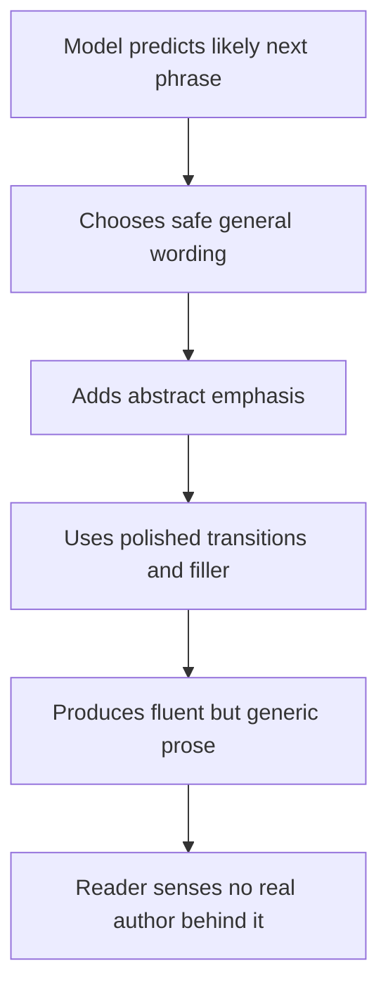
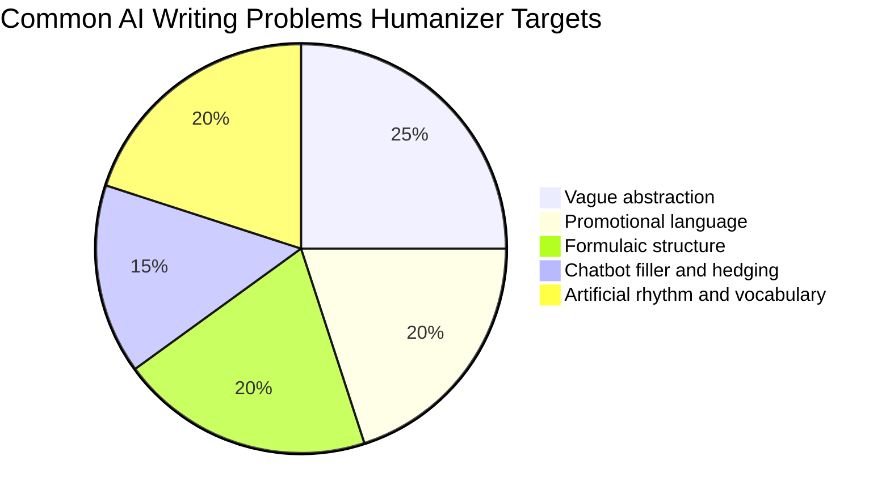

AI can write fast. That part is over.

The problem now is that a lot of AI writing still sounds like it was assembled by a committee that was trying very hard not to offend a toaster.

It is polished. It is grammatical. It is often useful. And yet something feels off.

That "off" feeling is exactly why the [Humanizer](https://github.com/blader/humanizer) skill exists.

## The Problem Humanizer Is Actually Solving

Bad AI writing is easy to spot. Everybody knows the examples.

- empty hype,
- padded conclusions,
- fake authority,
- sterile enthusiasm,
- and sentences that keep implying significance instead of saying anything concrete.

But the harder problem is *good-looking bad writing*. The kind that reads smoothly at first and still leaves no real impression. The kind that sounds capable and vague at the same time.

Humanizer is built for that second problem.

The repository README says the skill is based on Wikipedia's guide to [Signs of AI writing](https://en.wikipedia.org/wiki/Wikipedia:Signs_of_AI_writing), and that matters. It means the skill is not just chasing vibes. It is grounded in a documented set of recurring patterns people keep seeing in machine-generated text.

## Why Readers Notice AI Writing So Quickly

People do not usually detect AI writing because they ran a classifier in their head.

They notice because the prose keeps doing things humans rarely do on purpose:

- inflating significance,
- leaning on abstract words instead of specifics,
- forcing tidy lists of three,
- overusing transitions like `Additionally`,
- and closing with generic optimism that nobody actually earned.

The text is not wrong. It is evasive.

## The Most Useful Idea in the Skill

Humanizer does not just say, "Make it more natural."

It breaks the problem into patterns.

That is important because vague editing instructions lead to vague editing results. If you want better prose, you need to know what the model should cut, what it should replace, and what it should preserve.

According to the README and skill guidance, Humanizer looks for recurring issues such as:

- significance inflation,
- promotional language,
- vague attributions,
- AI-flavored vocabulary,
- copula avoidance,
- rule-of-three overuse,
- em dash overuse,
- filler phrases,
- and chatbot residue like "I hope this helps."

That list is more practical than it sounds. It gives you a repeatable editing checklist.

## Mermaid: Why AI Prose Feels Artificial



That final step is the real issue. Readers want a mind on the page, not just a sentence generator.

## What Humanizer Gets Right

The best part of the project is that it treats human writing as more than the absence of obvious AI markers.

The local skill guidance goes further than the README and makes a sharp point: a cleaned-up draft can still be dead on arrival if it has no voice. That is exactly right. Mechanical cleanup is not enough. Writing needs rhythm, point of view, and sometimes a little friction.

In other words, this skill is not only about removing bad patterns. It is about putting a person back into the draft.

## Before and After: What the Skill Is Fixing

### AI-sounding version

```txt
AI coding assistants stand as a pivotal force in the evolving landscape
of software development, showcasing their transformative potential across
teams, workflows, and outcomes.
```

### Better version

```txt
AI coding assistants are useful for the boring parts of the job.
They can save time on setup and boilerplate. They can also make you less
careful if you stop reviewing what they suggest.
```

The second version is not fancy. That is why it works.

## Chart: The Patterns That Usually Hurt Most



## How to Use Humanizer Without Wrecking the Draft

This matters: not every draft should be pushed toward the same tone.

If you run "humanization" as a blunt operation, you can strip away useful structure or flatten a deliberate formal voice. The goal is not to make every piece sound casual. The goal is to make the writing sound authored.

Use the skill well like this:

1. Start with a draft that already knows what it is trying to say.
2. Humanize after structure and facts are stable.
3. Preserve the intended voice: technical, essayistic, academic, direct, or conversational.
4. Ask for pattern-based cleanup, not "make this sound better."
5. Do one final pass for specifics, rhythm, and conviction.

## Code: A Sensible Workflow in Claude Code

```txt
/humanizer

Please humanize the draft below.
Keep it in plain English.
Do not make it casual for the sake of casualness.
Remove AI patterns, but preserve the technical tone and the author's point of view.
After the rewrite, briefly list any remaining phrases that still sound machine-generated.
```

That last sentence matters because the README notes a final audit pass. It is a smart move. A first rewrite often removes the loud signals and leaves the subtler ones behind.

## What Good Humanized Writing Actually Looks Like

It is usually more concrete.

It uses simpler verbs.

It stops pretending every paragraph is announcing a civilization-scale turning point.

And it lets a claim be modest when modesty is the honest shape of the claim.

## A Quick Editing Checklist

When I read AI-heavy copy, these are the questions I reach for first:

| Check | Bad sign | Better direction |
|---|---|---|
| Is the sentence saying something concrete? | Abstract nouns are doing all the work | Add facts, examples, or direct claims |
| Does it sound inflated? | Everything is pivotal, transformative, or vital | Scale the language to the evidence |
| Is the attribution real? | "Experts say" with no source | Name the source or cut the line |
| Is the rhythm too even? | Every sentence has the same polished cadence | Mix shorter and longer beats |
| Is there a real point of view? | The prose avoids any stance | Let the author sound like a person |

## Where Humanizer Helps the Most

This skill is especially strong for:

- blog posts generated from rough AI drafts,
- marketing copy that sounds suspiciously eager,
- technical explanations that became too polished and too empty,
- and editorial cleanup before publishing.

It is also useful as a teaching tool. Once you see the patterns enough times, you start catching them in your own prompts and drafts before they spread.

## Where It Will Not Save You

Humanizer can improve language. It cannot invent substance.

If the draft has weak ideas, fuzzy sourcing, or no real argument, you will still need an actual editorial pass. Cleaner nonsense is still nonsense.

That is worth saying because some teams try to use "humanization" as the final polish on text that was never strong enough to publish in the first place.

## The Deeper Lesson

What makes AI writing feel artificial is not just wording. It is distance.

The draft feels like nobody has skin in it. Nobody is willing to say, "This part is shaky," or "This is the trade-off that matters," or "I do not buy the hype here."

Human writing leaves fingerprints. AI writing often wipes the surface clean.

The Humanizer skill is useful because it pushes in the opposite direction. It tells the model to stop smoothing everything out and start sounding like somebody meant the words.

## Final Takeaway

If you publish a lot of AI-assisted writing, Humanizer is not a cosmetic tool. It is quality control.

Use it after the facts are solid and before the piece goes live. Let it remove the obvious tells. Then do the part no skill can fully automate: make sure the draft still has a mind, a voice, and a reason to exist.
