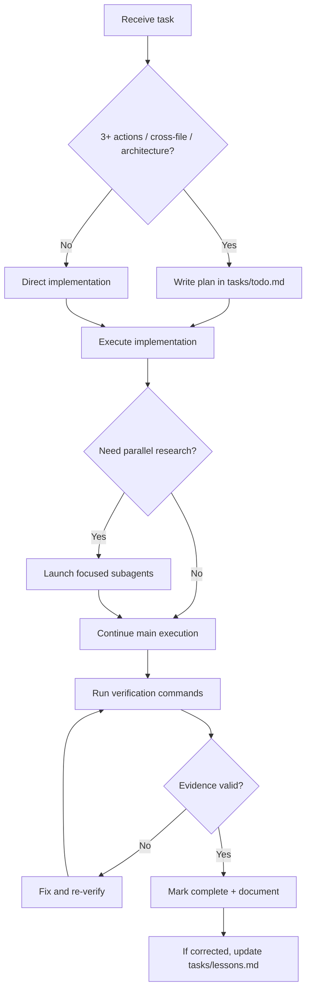
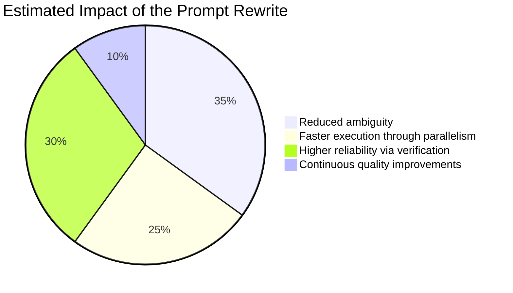

If your prompt already includes planning, verification, and subagents, you are ahead of most teams.

But even strong prompts can still create wasted cycles when instructions are ambiguous, conflicting, or hard to execute automatically.

This post rewrites your orchestration prompt into a cleaner, more enforceable version and explains **why each instruction should exist**.


## The Original Prompt Is Good — Here Is What Can Be Improved

Your existing workflow has excellent intent:

- Plan before coding.
- Use subagents for scale.
- Verify before completion.
- Capture lessons and continuously improve.

The biggest improvements are about **operational precision**:

1. Clarify when to stop and re-plan.
2. Distinguish mandatory steps from optional optimizations.
3. Define measurable exit criteria for each phase.
4. Prevent process overhead on trivial tasks.
5. Make the template copy-pasteable for immediate reuse.

## Sentence-by-Sentence Improvement Guide

Below is a sentence-level breakdown of why each section should be written the way it is.

### 1) Plan Node Default

**Sentence:** “Enter plan mode for any task with 3+ concrete actions, cross-file edits, or architecture decisions.”

**Why this wording works:** It replaces vague “non-trivial” language with practical trigger conditions, so the model does not guess whether planning is needed.

**Sentence:** “Store the plan in `tasks/todo.md` as checkboxes, and include validation steps.”

**Why this wording works:** It makes planning auditable and forces verification to be designed upfront rather than bolted on at the end.

**Sentence:** “If assumptions break, stop implementation and rewrite the plan before proceeding.”

**Why this wording works:** It prevents sunk-cost behavior and keeps the execution path aligned with the latest facts.

### 2) Subagent Strategy

**Sentence:** “Use subagents for research, broad codebase scanning, and independent analyses that can run in parallel.”

**Why this wording works:** It gives clear use-cases and avoids unnecessary delegation for tightly coupled edits.

**Sentence:** “Assign one objective per subagent and request summarized findings, not raw dumps.”

**Why this wording works:** It limits context bloat and improves synthesis quality in the primary thread.

### 3) Self-Improvement Loop

**Sentence:** “After a user correction, append one reusable rule to `tasks/lessons.md` with the trigger pattern and prevention behavior.”

**Why this wording works:** It transforms feedback into a repeatable operating rule instead of vague memory.

**Sentence:** “Review relevant lessons before starting similar tasks.”

**Why this wording works:** It creates a preflight quality gate and reduces repeated mistakes.

### 4) Verification Before Done

**Sentence:** “Do not declare completion without evidence: command output, build success, tests, or artifact proof.”

**Why this wording works:** It shifts from confidence-based completion to evidence-based completion.

**Sentence:** “When behavior changes, compare baseline vs updated behavior where feasible.”

**Why this wording works:** It detects regressions that may pass isolated tests but still break user workflows.

### 5) Demand Elegance (Balanced)

**Sentence:** “For non-trivial changes, perform one explicit elegance pass: simplify design, reduce branching, and remove duplicated logic.”

**Why this wording works:** It introduces quality without forcing over-engineering for simple fixes.

**Sentence:** “Skip the elegance pass for obvious one-line corrections.”

**Why this wording works:** It protects delivery speed and avoids process drag.

### 6) Autonomous Bug Fixing

**Sentence:** “When handling a bug report, identify failure evidence first (logs, failing tests, repro), then apply the smallest root-cause fix.”

**Why this wording works:** It keeps diagnosis disciplined and minimizes risky scope expansion.

## Improved Prompt Template (Drop-In)

```txt
# Workflow Orchestration

## 1) Planning (default)
- Enter planning mode for tasks with 3+ actions, cross-file edits, or architectural decisions.
- Write a checkbox plan in tasks/todo.md, including explicit validation steps.
- If assumptions fail or new constraints appear, stop implementation and re-plan.

## 2) Delegation (subagents)
- Use subagents for parallelizable research, discovery, and independent analysis.
- Give each subagent exactly one objective.
- Request concise summaries with findings, risks, and file references.

## 3) Learning loop
- After any user correction, add a rule to tasks/lessons.md:
  - Trigger pattern
  - Prevention rule
  - Example of correct behavior
- Review relevant rules before similar tasks.

## 4) Verification gate
- Never mark complete without evidence (tests, build output, artifacts, or logs).
- For behavior changes, compare before/after behavior when feasible.
- Report exactly which commands were run and their outcomes.

## 5) Elegance pass (balanced)
- For non-trivial changes, do one simplification pass.
- Remove unnecessary complexity and duplicated logic.
- Skip this pass for trivial fixes.

## 6) Autonomous bug fixing
- Triage with evidence first.
- Implement the smallest root-cause fix.
- Re-validate all impacted paths.
```

## Before vs After (Source Code Style Diff)

```diff
- Enter plan mode for ANY non-trivial task
+ Enter planning mode for tasks with 3+ actions, cross-file edits, or architecture decisions.

- If something goes sideways, STOP and re-plan immediately
+ If assumptions fail or constraints change, stop implementation and rewrite tasks/todo.md before continuing.

- Use subagents liberally
+ Use subagents only for parallelizable research or independent analysis; one objective per subagent.

- Never mark a task complete without proving it works
+ Completion requires evidence: command outputs, test/build status, or artifacts.
```

## Mermaid: Operational Flow



## Chart: Why This Rewrite Improves Delivery



## Practical Rollout Checklist

- Start by adopting only Sections 1 and 4 (planning + verification).
- Add subagent delegation rules once your team has stable task boundaries.
- Add the lessons loop when repeated correction patterns appear.
- Review the prompt monthly to remove stale constraints.

## Final Takeaway

A strong orchestration prompt should act like a lightweight operating system.

It must define *when to think*, *when to delegate*, *how to prove success*, and *how to learn from errors*.

The rewrite above keeps your original philosophy, but makes it more measurable, scalable, and easy to execute under real delivery pressure.
