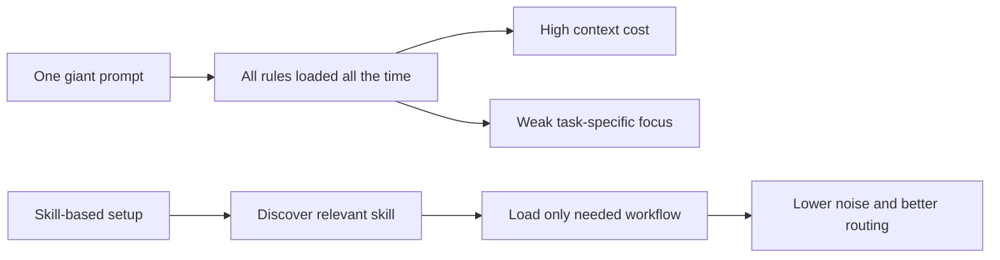
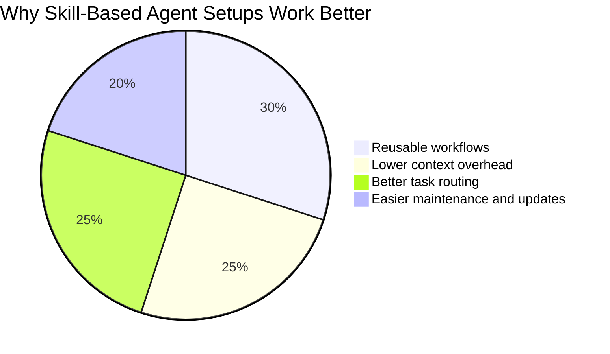
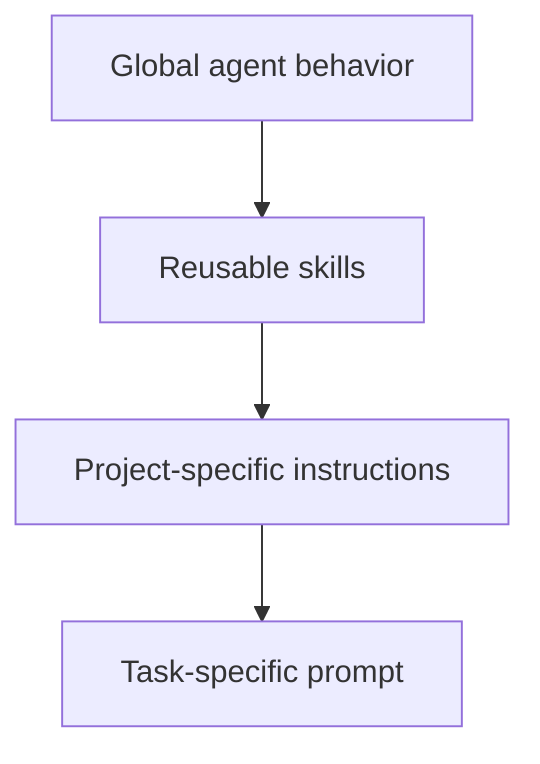

There is a common mistake people make when working with coding agents.

They keep adding more instructions to the main prompt.

At first it feels smart. You add workflow rules, code review rules, debugging rules, writing rules, Git rules, naming rules, testing rules. Soon your setup looks serious. It also starts to feel heavy, repetitive, and strangely unreliable.

That is where skills start to matter.

The installation guide in [`obra/superpowers`](https://github.com/obra/superpowers/blob/main/.codex/INSTALL.md) is short, but the idea behind it is much bigger than the commands themselves.

## What Superpowers Is Solving

Superpowers brings reusable skills into Codex through native skill discovery.

The installation guide describes a straightforward setup:

1. Clone the `superpowers` repository into `~/.codex/superpowers`.
2. Create a symlink from `~/.agents/skills/superpowers` to that skills directory.
3. Restart Codex so the skills are discovered.

That is the whole mechanical setup. The interesting part is *why* you would want this in the first place.

## Why Bigger Prompts Stop Scaling

When everything lives in one giant instruction file, three problems show up fast:

| Problem | What happens | Why it gets worse over time |
|---|---|---|
| Prompt bloat | Every task carries every rule | You pay context cost for instructions you do not need |
| Weak routing | The model must infer which rules matter right now | Good rules are ignored or misapplied |
| Maintenance pain | Updating one workflow means editing global guidance | The system becomes brittle and stale |

Skills fix this by turning reusable workflows into things the agent can discover and load when relevant.

That is a much cleaner model.

## Mermaid: Monolithic Prompt vs Skill-Based Workflow



This is not only about convenience. It is about operational clarity.

## The Install Guide, Translated Into Plain English

The official install steps are simple:

```bash
git clone https://github.com/obra/superpowers.git ~/.codex/superpowers
mkdir -p ~/.agents/skills
ln -s ~/.codex/superpowers/skills ~/.agents/skills/superpowers
```

Then restart Codex.

That symlink is the key detail. It means Codex does not need a custom bootstrap hack to find the skills. It can discover them through the normal skills path.

The guide also explains migration for older setups. If you previously used a bootstrap block in `~/.codex/AGENTS.md`, you should remove it after switching to native discovery.

That sounds small. It is not. Removing old bootstrap logic usually means fewer hidden dependencies, fewer surprises, and less setup debt.

## Why Skills Are Better Than Repetition

Say you keep telling your agent versions of the same thing:

- plan before complex work,
- use debugging discipline on bugs,
- verify before saying something is done,
- ask for design before building frontend features,
- request code review at the end.

Those are not one-off reminders. They are workflows.

A workflow deserves a home of its own.

That is what skills are for.

## Code: Verify the Install

The guide suggests a simple check:

```bash
ls -la ~/.agents/skills/superpowers
```

You should see a symlink or junction pointing to the cloned repository.

I would also check the target directly:

```bash
ls -la ~/.codex/superpowers/skills
```

If both look right and Codex has been restarted, the discovery path is usually in good shape.

## Chart: Why Teams Adopt Skill-Based Setups



## How to Use Superpowers Well After Installing It

Installing the repo is the easy part. The real payoff comes from how you use the skills afterward.

The productive pattern looks like this:

1. Let process skills shape the workflow first.
2. Use implementation skills only after the process is clear.
3. Keep project-specific rules in project files.
4. Keep reusable methods in skills.
5. Update the skill source once, not the same prompt in ten places.

This separation matters.

Project instructions answer, "What matters in this repo?"

Skills answer, "How should this class of work be done?"

Mixing those two layers carelessly is how agent setups become messy.

## A Good Mental Model

Think of your setup in three layers:



Each layer has a job:

- global behavior sets baseline safety and tool rules,
- skills provide reusable workflows,
- project instructions define repo context,
- and the task prompt describes the immediate goal.

When those layers are clean, the agent behaves more predictably.

## When Superpowers Feels Most Valuable

You feel the value fastest if you do any of the following:

- switch between debugging, frontend work, writing, and code review often,
- work across multiple repositories,
- collaborate with other people who need the same workflows,
- or keep discovering that your "perfect prompt" keeps turning into an instruction landfill.

If that last line feels familiar, skills are probably the missing abstraction.

## Common Mistakes After Installation

The install itself is simple, but the usage pattern still goes wrong in familiar ways:

| Mistake | Result |
|---|---|
| Treating skills like optional decoration | The agent falls back to generic behavior |
| Keeping old bootstrap logic around | Confusing setup and duplicated instructions |
| Stuffing repo-specific details into global skills | Skills become less reusable |
| Installing skills but never structuring prompts clearly | Better tools, same messy outcomes |

The fix is mostly discipline. Skills help when you let them carry real workflow weight.

## Updating and Uninstalling

The guide also keeps maintenance minimal:

```bash
cd ~/.codex/superpowers && git pull
```

Because the setup uses a symlink, updates flow through immediately after the repo changes.

To uninstall:

```bash
rm ~/.agents/skills/superpowers
```

Optionally remove the clone too:

```bash
rm -rf ~/.codex/superpowers
```

That is a clean lifecycle. No complicated installer state. No mystery bootstrap scripts hanging around years later.

## Final Takeaway

The install guide is short because the commands are simple. The payoff is not.

Superpowers matters because it nudges you toward a better way of working with coding agents:

- smaller prompts,
- clearer workflow routing,
- reusable methods,
- and less dependence on one bloated master instruction block.

If you are serious about agentic development, that shift is worth more than another long prompt full of rules the model may or may not use at the right moment.
