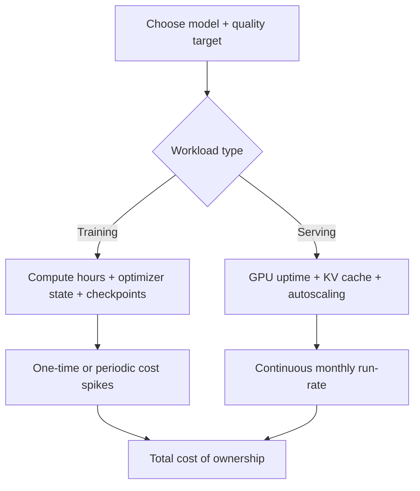
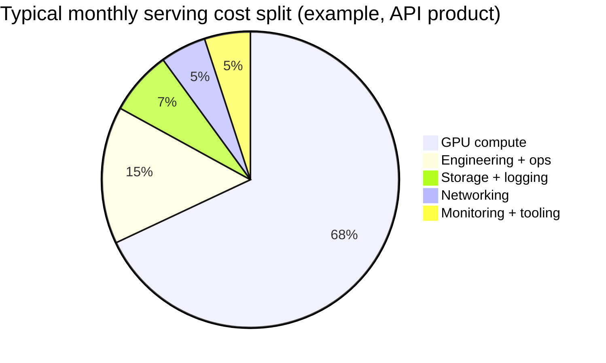

If you are planning to use open LLMs in production, the most important practical question is not just *"Which model is best?"* but:

> **Which model fits on which GPU, at what precision, with what latency and cost?**

This guide gives you a system-level mental model with concrete examples, formulas, code, and diagrams.


---

## 1) The Fast Mental Model

When you choose an open model, think in this order:

1. **Task target**: chat quality, coding quality, multilingual, long context, etc.
2. **Latency target**: e.g., p95 < 1.5s for chat, < 300ms/token for streaming.
3. **Concurrency target**: how many simultaneous users you need.
4. **Budget target**: both upfront and monthly.
5. **Deployment constraint**: single consumer GPU vs multi-GPU server cluster.

Then map those targets to model size and precision.

---

## 2) Core Formulas You Should Remember

### 2.1 Model weight memory

For a model with parameter count `P`:

`Weight Memory (bytes) = P × bytes_per_parameter`

Common precision assumptions:

- FP16/BF16: 2 bytes/param
- INT8: 1 byte/param
- INT4: 0.5 byte/param (plus quantization metadata overhead)

So a 7B model at FP16 is approximately:

`7 × 10^9 × 2 ≈ 14 GB`

### 2.2 Training memory (rough rule)

For full fine-tuning with Adam, practical memory is often approximated as:

`Training VRAM ≈ 12 to 16 × FP16 weight memory`

For LoRA/QLoRA, trainable state is much smaller, so single-GPU fine-tuning becomes feasible for 7B/13B-class models.

### 2.3 Serving throughput intuition

A simple throughput approximation (for decoder-only models):

`Tokens/sec ∝ (GPU_memory_bandwidth × utilization) / bytes_moved_per_generated_token`

This is why quantization and KV-cache optimizations matter as much as raw TFLOPS for inference.

---

## 3) Open Model Families and Typical Device Fit

> Numbers below are practical planning ranges, not absolute limits. Runtime engine, sequence length, batching, and tensor parallelism can shift them significantly.

| Model family (example) | Params | FP16 weight mem (approx) | INT8 (approx) | INT4 (approx) | Typical device fit |
|---|---:|---:|---:|---:|---|
| Llama 3.2 1B | 1B | ~2 GB | ~1 GB | ~0.6 GB | RTX 3060+ / Apple M-series / small edge GPU |
| Llama 3.1 8B / Mistral 7B class | 7B–8B | ~14–16 GB | ~7–8 GB | ~4–5 GB | RTX 4090 (24 GB), A10 (24 GB), L4 (24 GB) |
| Llama 3.1 70B class | ~70B | ~140 GB | ~70 GB | ~35–45 GB | Multi-GPU (2–8x A100/H100), high-end server only |
| Mixtral 8x7B (MoE, sparse active params) | 46.7B total | heavy | moderate with quantization | moderate | Usually multi-GPU for high-throughput serving |
| Qwen2.5 14B class | ~14B | ~28 GB | ~14 GB | ~8–10 GB | 1x 48 GB GPU or 2x 24 GB GPUs |

---

## 4) GPU Tiers and What They Are Good For

| GPU tier | Example hardware | Practical open-LLM usage |
|---|---|---|
| Consumer desktop | RTX 3060 12GB, RTX 4090 24GB | Local prototyping, low-concurrency inference, small LoRA experiments |
| Prosumer/workstation | RTX 6000 Ada 48GB | 13B–34B-class inference, stronger batch throughput |
| Cloud inference GPU | NVIDIA L4 24GB, A10G 24GB | Cost-efficient API serving for 7B–14B models |
| Cloud training GPU | A100 40/80GB, H100 80GB | Full finetuning, large context, high throughput serving |
| Multi-GPU nodes | 4x/8x A100 or H100 | 70B+ models, distributed training, high-QPS enterprise serving |

---

## 5) Training vs Serving Cost Structure



### Training cost drivers

- GPU-hours (largest component).
- Token volume and sequence length.
- Fine-tuning method (full FT vs LoRA/QLoRA).
- Checkpoint frequency and storage.

### Serving cost drivers

- Required p95 latency.
- Peak concurrency and autoscaling buffer.
- Context window size (KV cache memory pressure).
- Model precision and runtime (vLLM, TensorRT-LLM, TGI, etc.).



---

## 6) Practical Sizing Examples

### Example A: Startup chatbot (good quality, moderate traffic)

- Model: 8B instruct model (INT4/INT8)
- Traffic: 20 concurrent users, short-medium prompts
- Target: p95 first token < 1.5s
- Hardware option: 1x L4 or 1x A10G

Why this works:
- 8B INT4 often fits comfortably in 24GB VRAM with runtime overhead.
- Good price/performance for initial production.

### Example B: Enterprise coding assistant (higher quality)

- Model: 34B or 70B class
- Traffic: high concurrency, longer outputs
- Target: higher answer quality + reliability
- Hardware option: multi-GPU A100/H100 nodes

Why this works:
- Larger models improve reasoning/coding quality in many workloads.
- But memory and latency force tensor parallel + optimized serving stack.

---

## 7) Quick Estimator Code (Memory and Monthly Serving Cost)

```python
from dataclasses import dataclass

@dataclass
class LLMPlan:
  params_b: float                 # model params in billions
  precision_bytes: float          # 2.0 fp16, 1.0 int8, 0.5 int4
  overhead_factor: float = 1.25   # runtime + kv/cache + fragmentation estimate

  def weight_memory_gb(self) -> float:
    return self.params_b * self.precision_bytes

  def required_vram_gb(self) -> float:
    return self.weight_memory_gb() * self.overhead_factor


def monthly_gpu_cost(hourly_rate: float, gpu_count: int = 1, utilization: float = 0.65) -> float:
  # utilization here means average active fraction of provisioned capacity
  monthly_hours = 24 * 30
  return hourly_rate * gpu_count * monthly_hours / max(utilization, 1e-6)


# Example: 8B model at int4 on one $0.80/hr GPU
plan = LLMPlan(params_b=8.0, precision_bytes=0.5, overhead_factor=1.3)
print('Estimated VRAM needed (GB):', round(plan.required_vram_gb(), 2))
print('Estimated monthly GPU cost ($):', round(monthly_gpu_cost(0.80), 2))
```

---

## 8) Decision Matrix: Which Setup Should You Start With?

| Situation | Recommended model range | Recommended hardware | Notes |
|---|---|---|---|
| Solo developer / local R&D | 3B–8B | 12–24GB consumer GPU | Prefer INT4 + fast inference engine |
| MVP API (small production) | 7B–14B | 1x L4/A10G/4090 | Great cost-quality starting point |
| Mid-scale SaaS assistant | 14B–34B | 1–4 enterprise GPUs | Add batching, autoscaling, prompt caching |
| High-quality enterprise assistant | 34B–70B+ | Multi-GPU cluster | Stronger eval + safety + observability required |

---

## 9) Common Mistakes (and How to Avoid Them)

1. **Choosing model first, constraints later**  
   - Start from SLA, concurrency, and budget.
2. **Ignoring KV cache growth with long context**  
   - Test real prompt lengths early.
3. **Using FP16 everywhere by default**  
   - Benchmark INT8/INT4 quality impact before deciding.
4. **No evaluation harness before scaling**  
   - Establish quality + latency + cost dashboards first.
5. **Underestimating serving complexity**  
   - Runtime choice and batching policy often dominate cost.

---

## 10) Final Takeaway

A practical rule that works for many teams:

- Start with **7B–14B** models.
- Serve with **INT4/INT8** on **24GB-class GPUs**.
- Add **LoRA/QLoRA** for domain adaptation.
- Move to **34B/70B** only when your quality gap is measured and meaningful.

If you understand the relationship between **model size ↔ precision ↔ memory ↔ latency ↔ cost**, you can design an OpenLLM stack that is both technically strong and financially sustainable.
