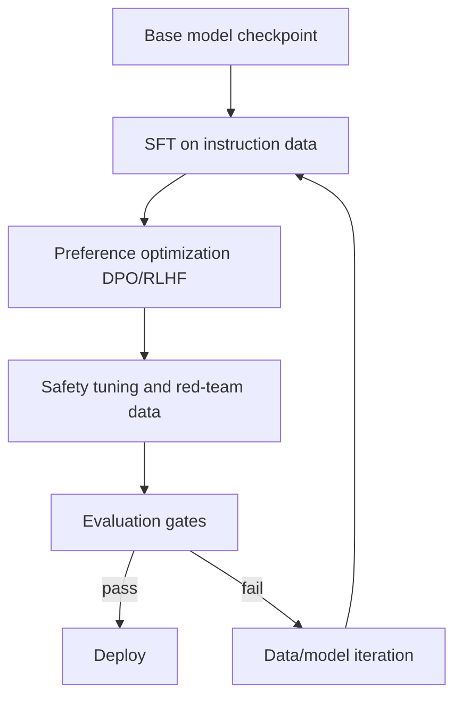

If pretraining gives a model raw language ability, **post-training** teaches it to behave like a useful assistant.

In plain words, post-training is where we make a base model:
- follow instructions,
- prefer better answers,
- avoid unsafe behavior,
- and stay reliable under production constraints.


## 1) What Is Post-Training?

A practical post-training stack usually has three stages:

1. **Supervised Fine-Tuning (SFT)**
   - Train on prompt-response pairs written or curated by humans.
2. **Preference Optimization**
   - Train the model to choose preferred outputs (e.g., DPO, PPO/RLHF variants).
3. **Safety + Robustness Tuning**
   - Add policy/safety datasets and adversarial evaluations.

A concise objective view:

```text
L_total = L_sft + λ_pref * L_pref + λ_safe * L_safe
```

Where:
- `L_sft` teaches instruction following,
- `L_pref` pushes the model toward preferred responses,
- `L_safe` penalizes unsafe or policy-violating behavior,
- and `λ` values control trade-offs.

## 2) The Core Equations (No PhD Required)

### 2.1 SFT Loss (token cross-entropy)

```text
L_sft = - Σ_t log p_θ(y_t | x, y_<t)
```

Intuition: maximize probability of the correct next token in the reference answer.

### 2.2 Preference Loss (DPO-style intuition)

For a prompt `x`, preferred answer `y+`, rejected answer `y-`:

```text
L_pref = - log σ(β * [log π_θ(y+|x) - log π_θ(y-|x)
                      - log π_ref(y+|x) + log π_ref(y-|x)])
```

Intuition: make preferred answers relatively more likely than rejected ones while staying anchored to a reference policy.

### 2.3 Safety-Constrained Objective

```text
maximize   Helpfulness(θ)
subject to UnsafeRate(θ) ≤ ε
```

Intuition: we do not only maximize quality; we enforce safety constraints.

## 3) A Production Workflow (Mermaid)



## 4) Minimal Training Code Example (PyTorch-style)

```python
import torch
import torch.nn.functional as F

# logits: [batch, seq, vocab], labels: [batch, seq]
def sft_loss(logits, labels, ignore_index=-100):
    vocab = logits.size(-1)
    return F.cross_entropy(
        logits.view(-1, vocab),
        labels.view(-1),
        ignore_index=ignore_index,
    )

# logp_chosen / logp_rejected: [batch]
def dpo_loss(logp_chosen, logp_rejected, ref_chosen, ref_rejected, beta=0.1):
    margin = beta * ((logp_chosen - logp_rejected) - (ref_chosen - ref_rejected))
    return -F.logsigmoid(margin).mean()

# combined objective in one training step
def total_loss(logits, labels, dpo_terms, lambda_pref=0.5, lambda_safe=0.2, safe_penalty=0.0):
    loss_sft = sft_loss(logits, labels)
    loss_pref = dpo_loss(*dpo_terms)
    return loss_sft + lambda_pref * loss_pref + lambda_safe * safe_penalty
```

## 5) Example Quality/Latency Trade-off Chart


The chart reflects a common real-world pattern:
- Helpfulness improves quickly after SFT and preference tuning.
- Harmlessness improves most after safety tuning.
- Latency can increase as safety and reranking logic gets added.

## 6) How to Evaluate Post-Training

Use a balanced scorecard instead of one metric:

- **Capability**: instruction-following accuracy, task success rate.
- **Preference alignment**: win-rate vs baseline in pairwise evals.
- **Safety**: policy violation rate, jailbreak success rate.
- **Reliability**: hallucination rate, citation correctness.
- **Efficiency**: p95 latency, tokens per response, serving cost.

A practical release gate example:

```text
Ship if:
- WinRate >= +4.0% vs current production model
- UnsafeRate <= 0.5%
- HallucinationRate <= baseline
- p95 latency <= 2.0s
```

## 7) Common Mistakes and Fixes

1. **Mistake: over-optimizing one metric**
   - Fix: keep hard safety/latency guardrails.
2. **Mistake: noisy preference labels**
   - Fix: improve rubric quality and annotator agreement checks.
3. **Mistake: no segment-level analysis**
   - Fix: evaluate by language, domain, and user intent buckets.
4. **Mistake: skipping adversarial tests**
   - Fix: add red-team suites before every release.

## 8) Quick Mental Model

Think of post-training as **behavior engineering for a pretrained brain**:
- SFT teaches structure,
- preference tuning teaches taste,
- safety tuning teaches boundaries,
- evaluation protects users and product quality.

If you build with this loop, your model gets not only smarter, but also safer and more deployable.
