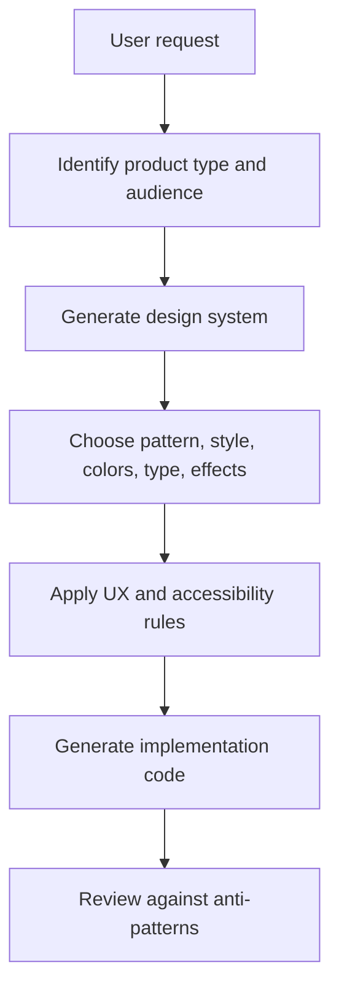
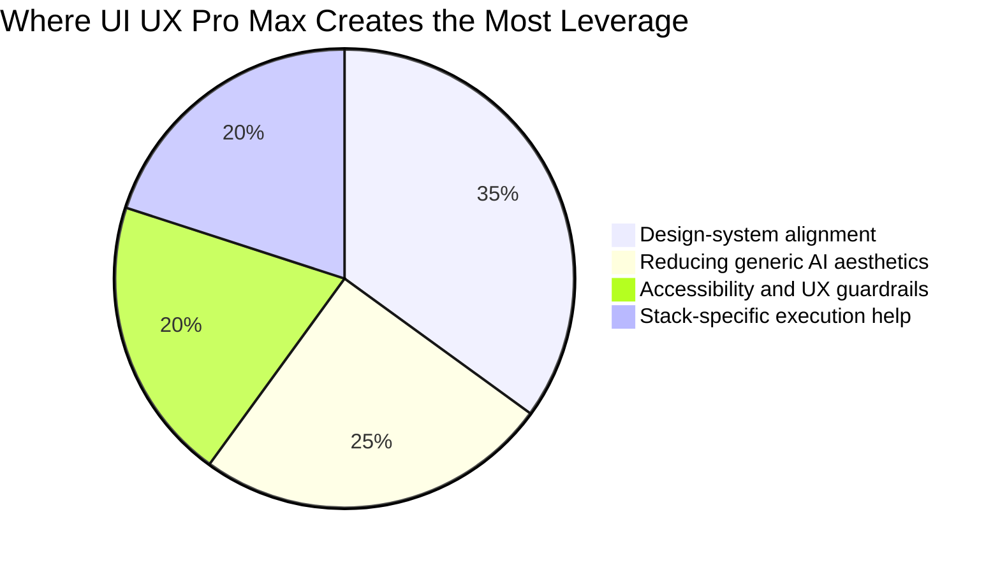

Most AI coding tools can produce UI code.

That is not the same thing as producing good UI.

This gap matters more than people admit. A model can generate a hero section, a dashboard, or a pricing card in seconds, but speed does not solve the hard part. The hard part is taste. The hard part is choosing a visual direction that fits the product, the audience, the device, the brand, and the conversion goal.

That is the problem [UI UX Pro Max](https://github.com/nextlevelbuilder/ui-ux-pro-max-skill) is trying to solve.


## The Real Problem: AI Can Build Layouts Without Building Judgment

Here is the failure mode most teams hit:

1. They ask an AI to build a landing page.
2. The AI gives them something polished enough to look finished.
3. The result is still generic, off-brand, or awkward to use.

It happens because most prompts describe the *page*, not the *design system behind the page*.

If you say, "Build a fintech dashboard," you will usually get a dashboard. But should it feel dense or calm? Dark or light? Executive or operator-focused? Conservative or high-energy? Should charts lead the page, or should risk controls lead the page? What typography carries trust instead of startup theater?

Those are design decisions. They cannot be fixed by sprinkling more Tailwind classes on top.

## What UI UX Pro Max Actually Adds

According to the repository README, the skill packages a large UI/UX knowledge base around:

- dozens of UI styles,
- industry-specific color palettes,
- font pairings,
- chart recommendations,
- UX and accessibility rules,
- and a reasoning layer that turns product context into a concrete design-system recommendation.

The useful idea is simple: before the model starts writing JSX, Astro, or Tailwind, it should decide what kind of interface it is building.

## Why That Matters More Than Another "Beautiful UI" Prompt

Prompt-only UI generation tends to fail in four predictable ways:

| Failure | What it looks like | Why it hurts |
|---|---|---|
| Style drift | Every section looks like a different template | The product feels untrustworthy |
| Trend bias | Purple gradients everywhere, regardless of use case | The interface signals "AI demo" instead of product clarity |
| Accessibility debt | Weak contrast, tiny hit targets, vague focus states | The site looks polished and still fails users |
| No product fit | Same design language for banking, wellness, and dev tools | The UI misses the mood the business actually needs |

UI UX Pro Max tries to reduce that by front-loading design choices.

## The Core Mental Model

Think of the skill as a design brief generator for AI.

Instead of asking the model to improvise everything from scratch, you ask it to derive:

- a page pattern,
- a visual style,
- a color system,
- a typography direction,
- interaction rules,
- anti-patterns to avoid,
- and stack-specific implementation guidance.

That changes the workflow from "generate a page" to "generate a system, then generate a page from the system."

## Mermaid: The Better Workflow



That extra design-system step is where most of the value lives.

## What the Repository Suggests

The project README highlights a few implementation details that are worth paying attention to:

- It supports many stacks and assistants, not just one.
- It includes a CLI installation path through `uipro-cli`.
- It exposes a direct search workflow for style, typography, charts, landing patterns, and stack guidance.
- It supports persisted design systems through a `design-system/MASTER.md` pattern plus page-specific overrides.

That last part is the most strategic feature in the whole project.

## The Best Feature: Persistent Design Systems

Most AI-generated UI work falls apart over time, not on day one.

The first page might look good. The second page looks related. By the fifth page, the product has three button radii, two card shadows, four spacing rhythms, and a typography stack that feels like it was assembled during a power outage.

Persistent design-system files fix that.

The README describes a workflow where you can store global rules in `design-system/MASTER.md` and page-level deviations in `design-system/pages/<page>.md`. That gives the model a stable source of truth instead of asking it to remember design consistency from chat history alone.

## Code: A Practical Starting Point

```bash
# Install the CLI
npm install -g uipro-cli

# Initialize the skill for Codex CLI
uipro init --ai codex

# Generate a design system directly
python3 .codex/skills/ui-ux-pro-max/scripts/search.py \
  "B2B fintech analytics dashboard" \
  --design-system \
  --persist \
  -p "Northstar Risk"
```

Once you have that, your prompt quality changes immediately:

```txt
Read design-system/MASTER.md first.
Build the overview dashboard page for a B2B fintech analytics product.
Keep the interface operator-focused, calm, and high-trust.
Prefer light mode, dense information hierarchy, clear error states,
and restrained motion.
```

That is a much stronger input than "make a nice dashboard."

## Before and After: Prompt Quality

### Weak prompt

```txt
Build a modern dashboard for my fintech app.
```

### Better prompt

```txt
Use the persisted design system for this project.
Prioritize trust, legibility, and dense but calm information layout.
Avoid neon accents, glass-heavy panels, and decorative motion.
Primary users are finance operators reviewing risk and settlement status.
Build the dashboard in Astro with React islands and Tailwind utilities.
```

The second prompt gives the AI a point of view. That is what good design needs.

## Chart: Where the Skill Helps Most



## How to Use It Well

If you install the skill and stop at "make this prettier," you will miss most of its value.

Use it well like this:

1. Start with product context, not component requests.
2. Generate the design system before asking for code.
3. Persist the design system when the project has more than one page.
4. Use page overrides only when a page truly needs a different tone.
5. Re-run the design-system step when the audience or product category changes.

## What to Tell the Model Up Front

The skill gets better when your request includes:

- product type,
- target audience,
- trust level or brand tone,
- primary goal of the page,
- preferred stack,
- and constraints such as accessibility, density, or motion limits.

Good:

```txt
Design a healthcare appointment dashboard for clinic staff.
Light theme. Fast scanning. High accessibility.
Use Astro plus React islands. Avoid decorative gradients.
```

Bad:

```txt
Make a cool healthcare dashboard.
```

The second prompt almost guarantees a shallow result.

## A Useful Way to Think About Style

A lot of AI-generated UI looks impressive in screenshots and weak in products.

That is because screenshots reward novelty, while products reward repeatable clarity.

UI UX Pro Max is useful when you need the model to optimize for the second thing. It gives the AI a structured way to pick a design language that can survive real navigation, real forms, real error states, and real users.

## Who Should Use It

This skill is especially useful for:

- solo builders who do not have a designer on every iteration,
- engineers who can implement quickly but want stronger design direction,
- teams using AI to scaffold interfaces across multiple pages,
- and anyone who is tired of getting "AI purple gradient SaaS" no matter what they asked for.

## Where It Can Still Go Wrong

The skill improves design decisions, but it does not replace product judgment.

You still need to review:

- whether the chosen style fits your actual brand,
- whether the generated hierarchy matches task importance,
- whether data-dense interfaces are truly readable,
- and whether the final code respects the rules it was given.

In other words, this is not autopilot. It is better instrumentation.

## Final Takeaway

UI generation is cheap now. Design coherence is not.

That is why a skill like UI UX Pro Max matters. It gives AI something most code-generation workflows are missing: a way to reason about visual systems before touching the code.

If you use AI for frontend work, this is the shift worth making:

Stop asking for pages.

Start asking for design systems, constraints, and product fit. The page quality goes up because the decisions behind the page stop being random.
